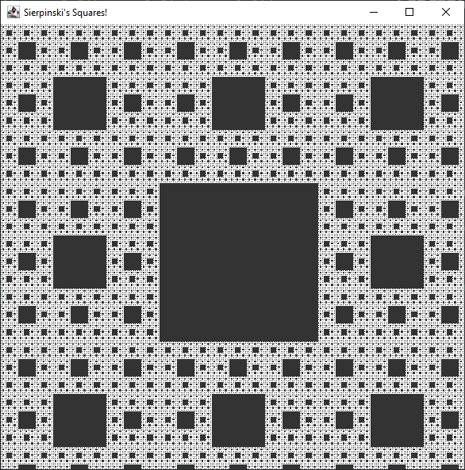

# Fractales de Sierpinski

>Auteur: Raphaël Roumat

Projet scolaire de DUT Informatique.

Bibliothèques d'UI:

- `Swing`

## Description:

Programme permettant la génération de fractales de Sierpinski triangulaires ou carrés. Dans le cadre de ce projet scolaire un squelette de départ est fournie avec une fenêtre vide, la génération des fractales et leur affichage doit être ajouté.

## Résultat

 |   Triangle   |  Carré   |
 | :----: | :----: |
|  |   |